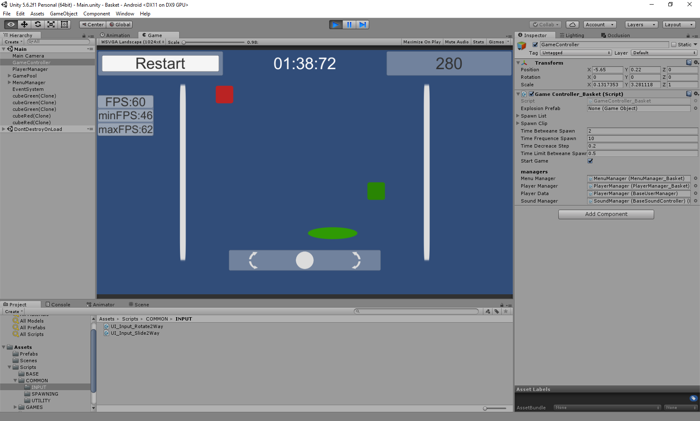

# Basket (Arcade-catcher 2D, with non standard control)

## Task:
Task to perform in a 2D project
1) At the bottom of the scene is a plane, on the plane is a round sprite.
2) The inclination of the plane can be changed by pulling on one or the other end.
 In this way we can control the movement of the circle. The circle should not
 fly out of the scene.
3) From above, 2 kinds of elements randomly fall on the circle. Touching one, points
 are added to the total score, and when touched with others they are taken away.
4) In the upper right corner shows the total score.
5) There is a restore button.

## Implemented:
All

Additional:
1) Increase the frequency of falling elements (every 10 seconds).
2) Display the game timer on the screen.
3) Added sounds when capturing items.
4) Pause / Continue the game when you press Esc.

## Unity 2019

